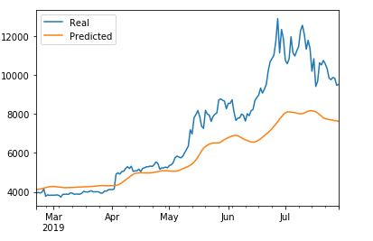
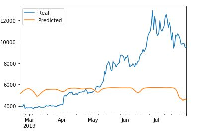
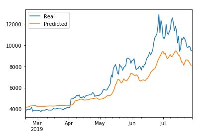
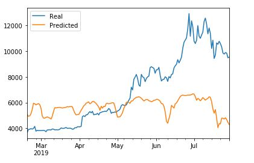

# Long short-term memory (LSTM) Stock Predictor

In this assignment, deep learning Recurrent Neural Networks(RNN) were used to model bitcoin closing prices. One model used the Crypto Fear and Greed Index(FNG) indicators to predict the closing price while the second model used a window of previous closing prices to predict the next closing price.

## Steps to build and train the custom LSTM RNN models:

1. Two LSTM models were created; one model used the FNG values to predict the bitcoin closing price and the other model used a window of previous closing prices to predict the next closing price.

2. Each model used 70% of the data for training and 30% of the data for testing the models.

3. MinMaxScaler was applied to the X and y values to scale the data for the models.

## Performance evaluation of each model:

1. Which model has a lower loss?

    The closing price model had a lower loss of `0.0393` vs the FNG model that had a loss of `0.1140` for a window size of 10.

2. Which model tracks the actual values better over time?

    The closing price model tracked the actual values better over time. This can be seen in the real vs predicted values plots below:

    ### Closing Price Model; Window size(10) :

    

     ### FNG Model; Window size(10) :
 
    

3. Which window size works best for the model?

    After experimenting with window sizes from 1 to 10 and seeing how the model performance changes, the best results were achieved with a window size of `4` that showed lower loss and better tracking of actual values. The results are as follows:

    ### Window Size `4` model performance:

    **Loss**:

    Closing Price Model : `0.0227`

    FNG Model : `0.0975`

    **Real vs Predicted values plot**:

    #### Closing Price Model; Window size(4) :

    

    #### FNG Model; Window size(4) :
 
    

